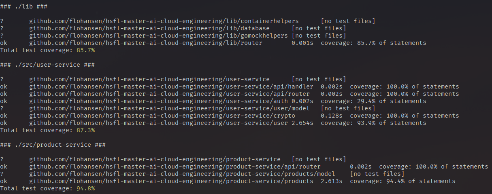

# Cloud Engineering: Aufgabenblatt 2

In diesem Aufgabenblatt werden Sie die ersten Bestandteile Ihrer Architektur
umsetzen. Dabei lernen Sie, wie HTTP-Routing funktioniert und implementiert
wird. Außerdem beginnen Sie die Implementierung Ihrer Microservices.

## Aufgabe 1: HTTP Routing

1. Erstellen Sie ein neues Verzeichnis mit einem Go-Module, welches in Zukunft
   als Bibliothek für Ihre Unterprojekte (z.B. Microservices) verwendet werden
   kann.
2. Entwickeln Sie einen Router, welcher das `Handler` Interface aus dem
   Package `net/http` implementiert.
3. Der Router soll mithilfe von Pattern-Matching eingehende Anfragen auf
   entsprechende Handler umleiten. Implementieren Sie hierfür Methoden zum Routen
   von `GET`, `POST`, `PUT` und `DELETE` Anfragen.
4. Lesen Sie mithilfe von regulären Ausdrücken entsprechende Requestparameter
   aus und setzen Sie diese als Request-Context-Values, damit diese innerhalb der
   Handler zur Verfügung stehen.

## Aufgabe 2: Microservices

1. Implementieren Sie mindestens drei Ihrer geplanten Microservices aus
   Aufgabenblatt 1 als RESTful Services. Verwenden Sie hierfür Ihre Implementierung
   des HTTP-Routers aus Aufgabe 1.
2. Eines dieser Services soll ein Authentifizierungsdienst sein, mit dem sich
   Nutzer bei Ihrem Produkt anmelden und entsprechende Tokens anfragen können.
   Verwenden Sie hierfür Json Web Tokens (JWT), die mithilfe eines asymmetrischen
   Kryptosystems (z.B. RSA, ECDSA, ...) verschlüsselt und validiert werden können.
   Achten Sie darauf, dass die Schlüssel nicht committet werden.
3. Falls Ihre Architektur aus zu vielen Services besteht, dann können Sie diese
   auch im Laufe des Semesters zuende stellen.

## Aufgabe 3: Testing

1. Entwickeln Sie Unit-Tests für Ihre Microservices. Testen Sie die wichtigsten
   Features. Sie können auf triviale Tests verzichten, falls dies zu viel
   Zeitaufwand bedeuten würde.
2. Erreichen Sie eine Testabdeckung von mindestens 60%. Sie können hierfür z.B.
   das Tool `go test` verwenden (siehe Hinweise).

## Hinweise
### Go Test Coverage Report
Sie können mithilfe des Tools `go test` einen Bericht für Ihre Testabdeckung erzeugen. Führen Sie zunächst

    go test ./... -coverprofile=cover.out

in einem Ihrer Go-Modules aus. Dies erzeugt eine Datei, die alle Einzelheiten bezüglich der Testergebnisse enthält. Die Ergebnisse lassen wir nun durch

    go tool cover -func cover.out

analysieren. Durch den Parameter `-func` werden Analysen anhand Ihrer
Testfunktionen gefahren. In Ihrem Terminal sollten Sie nun die Testabdeckung
aller Ihrer Funktionen/Methoden sehen können. Am Ende der Ausgabe wird Ihnen
zusätzlich der Durschnitt aller Testabdeckungen für das gesamte Go-Module
angezeigt. **Es macht Sinn, diesen Prozess nicht immer manuell
auszuführen, sondern hierfür ein Skript zu entwickeln.** Ein Beispiel für ein
solches Skript finden Sie im
[Beispiel-Repository](https://github.com/flohansen/hsfl-master-ai-cloud-engineering-01)
unter `scripts/run-go-tests.sh`. Wenn Sie möchten, können Sie das Skript in Ihr
Projekt übernehmen und mit

    ./scripts/run-go-tests.sh

ausführen. Das Skript wechselt dann in jedes Verzeichnis, welches ein Go-Module
ist, führt alle Tests aus und zeigt die Testabdeckung für jedes Modul dar.

