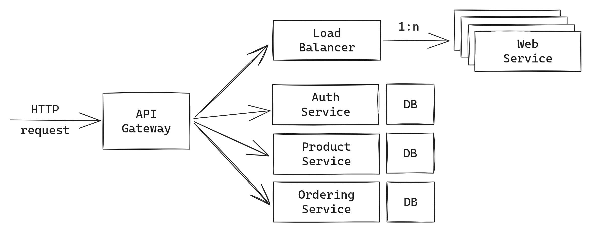

# Cloud Engineering: Aufgabenblatt 5

In dieser Übung sollen Sie sich in das Prinzip eines Load-Balancers einarbeiten
und einen geeigneten Use-Case speziell für Ihren Anwendungsfall überlegen. Das
Ziel ist es, dass Sie ein Verständnis für das Design einer Architektur unter
Berücksichtigung enormer Zugriffszahlen auf Ihr System entwickeln.

## Aufgabe 1: Container Orchestration
1. Entwickeln Sie ein Verfahren zum Verwalten von Docker-Containern.

2. Das Verfahren sollte eine bestimmte Menge (Replicas) einer Anwendung als
   Docker-Container starten.

3. Die Container sollten automatisiert aufgeräumt werden.

4. Sie können dies entweder manuell (z.B. mit Docker-Compose) oder automatisiert
   mit dem [Docker Engine SDK](https://docs.docker.com/engine/api/sdk/) umsetzen.

## Aufgabe 2: Load-Balancing

1. Arbeiten Sie sich in die Algorithmen für das Load-Balancing ein (siehe
   Hinweise) und entwickeln Sie einen Load-Balancer in Go.

2. Der Load-Balancer soll die eingehende Last an eine Menge von Anwendungen
   verteilen. Dieser agiert ähnlich zu einem Reverse-Proxy, wobei der Typ der
   Anwendung bei einem Load-Balancer immer gleich ist.

3. Implementieren Sie drei Algorithmen für das Verteilen eingehender Anfragen in
   den Load-Balancer. Diese sollen im Load-Balancer einfach austauschbar sein. Im
   Anhang finden Sie eine Liste möglicher Algorithmen.

4. Implementieren Sie einen Health-Check für die Ziele des Load-Balancers. Der
   Load-Balancer soll keine Anfragen an Anwendungen weiterleiten, wenn diese als
   Unhealthy deklariert sind. Die Anwendung selbst soll hierfür einen Endpunkt zum
   Bestimmen des Gesundheitsstatus bereitstellen, den der Load-Balancer regelmäßig
   (z.B. alle 10 Sekunden) in einem separaten Thread anfragt.

   Beispiele:

   * Eine Anfrage auf `/health` liefert die Antwort `200 OK` → Endpunkt ist gesund.
   * Eine Anfrage auf `/health` liefert keine Antwort oder es passiert ein Fehler → Endpunkt ist ungesund.

5. Überlegen Sie sich, für welche(n) Microservice(s) es Sinn macht, ein
   Load-Balancing zu verwenden. Integrieren Sie den Load-Balancer an entsprechenden
   Stellen in Ihrer Architektur und aktualisieren Sie Ihr Architekturbild.

## Hinweise
### Load-Balancing-Algorithmen

1. **Round Robin:**
    * Anfragen werden in einer zirkulären Reihenfolge an jeden Server weitergeleitet.
    * Einfach und leicht umzusetzen, berücksichtigt jedoch möglicherweise nicht die Auslastung oder Kapazität
      der Server.

2. **Least Connections:**
    * Neue Anfragen werden an den Server mit den wenigsten aktiven Verbindungen gesendet.
    * Nützlich, wenn die Auslastung der Server aufgrund unterschiedlicher Verbindungsdauern variiert.

3. **Least Response Time:**
    * Anfragen werden an den Server mit der schnellsten Antwortzeit gesendet.
    * Dieser Algorithmus erfordert die Messung und Überwachung der Antwortzeiten.

4. **Weighted Round Robin:**
    * Ähnlich wie Round Robin, aber jedem Server wird ein Gewicht basierend auf seiner Kapazität zugewiesen.
    * Server mit höherer Kapazität erhalten mehr Anfragen.

5. **Weighted Least Connections:**
    * Ähnlich wie Least Connections, aber Server erhalten Gewichtungen basierend auf ihrer Kapazität.
    * Server mit höherer Kapazität erhalten weniger Verbindungen.

6. **IP-Hash:**
    * Verwendet eine Hash-Funktion basierend auf der IP-Adresse des Clients, um zu bestimmen, welcher
      Server die Anfrage bearbeiten wird.
    * Nützlich für die Aufrechterhaltung der Sitzungspersistenz.

7. **Chained Failover:**
    * Server werden priorisiert, und wenn der primäre Server ausfällt, wird die Anfrage an den nächsten
    verfügbaren Server in der Liste weitergeleitet.

8. **Least Bandwidth:**
    * Sendet Anfragen an den Server mit der geringsten aktuellen Traffic-Menge (Bandbreitennutzung).

9. **Response Time-Based (Adaptive):**
    * Überwacht die Antwortzeiten der Server und passt die Verteilung basierend auf
    der aktuellen Leistung
    an.