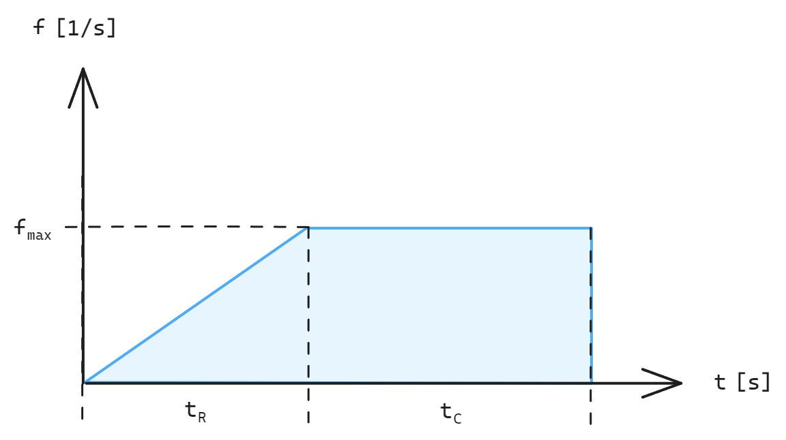

# Cloud Engineering: Aufgabenblatt 6

## Aufgabe 1: Monitoring

> 💡 **Information:**
> Sie können die Manifests aus [diesem Beispiel](SETUP.md) verwenden, um ein Basis-Setup für die Resourcen dieser Aufgabe zu deployen.

1. Erstellen Sie Manifests in Ihrem Projekt, um [Prometheus](https://prometheus.io/docs/introduction/overview/) und [Grafana](https://grafana.com/docs/grafana/latest/) auf Ihrem Kubernetes-Cluster deployen zu können.
2. Das gesamte Monitoring soll unter dem Namespace `monitoring` laufen.
3. Der Prometheus-Stack soll Metriken über das gesamte Cluster bereitstellen.
4. Der Prometheus-Stack soll Metriken mithilfe vom Node-Exporter aller Nodes bereitstellen.
5. Der Prometheus-Stack soll Alarming ermöglichen.
6. Verbinden Sie Grafana mit Prometheus als Datenquelle.
7. Erstellen Sie ein Dashboard, auf dem die folgenden Metriken für Cluster und Nodes mithilfe von [PromQL](https://prometheus.io/docs/prometheus/latest/querying/basics/) visualisiert werden:
    * Graph: CPU Utilization
    * Graph: Memory Utilization
    * Graph: Network RX (Receive)
    * Graph: Network TX (Transmit)
8. Exportieren Sie das Dashboard und speichern Sie es in Ihrem Monorepo.

## Aufgabe 2: Tool für Cluster-Benchmark

> 💡 **Information:**
> [Hier](load.config.json) finden Sie ein Beispiel für eine Konfigurationsdatei für Aufgabe 2.6. und [hier](config.go) ein Beispiel für das Deserialisieren der JSON-Konfiguration in ein Go-Struct.

1. Entwickeln Sie ein Werkzeug zum Testen Ihrer Cluster-Performance in Go. Das Tool soll eine festlegbare Last auf HTTP-Server erzeugen.
2. Verwenden Sie [Goroutinen](https://go.dev/tour/concurrency/1) und [Channels](https://go.dev/tour/concurrency/2), um mithilfe von Concurrency und Multithreading User-Requests und damit die Last in Form eines User-Pools zu erzeugen. [Hier](https://gobyexample.com/worker-pools) finden Sie ein einführendes Beispiel für Worker-Pools in Go.
3. Der Lastttest soll zufällig Endpunkte anfragen. Die Endpunkte sollen als Liste bzw. Slice zur Verfügung gestellt werden.
4. Die Last soll sich mithilfe einer Rampe aufbauen. Implementieren Sie hierfür einen linearen Anstieg der Last (konstante Steigung) über den Zeitraum `t``R`.
5. Nach der Rampup-Phase soll sich eine konstante Last `f = f``max` über den Zeitraum `t``C` einstellen. Nach dieser Zeit wird die Last fallen gelassen und sinkt auf auf den Nullpunkt, sodass `f = 0`.
6. Lesen Sie eine Konfigurationsdatei (JSON) ein, um Parameter des Lasttests einstellen zu können. 
    - `users`: Anzahl der Goroutines zum Simulieren der User.
    - `rampup`: Dauer der Rampup-Phase `t``R`.
    - `duration`: Dauer des gesamten Testzeitraums `t``R` `+ t``C`.
    - `targets`: Liste der anzufragenden Endpunkte im Lasttest.

## Aufgabe 3: Alarming
> 💡 **Information:**
> Die Prometheus-Konfiguration finden Sie in [diesem Manifest](monitoring/prometheus/config-map.yaml).

1. Erstellen Sie folgende Alerts, indem Sie die Prometheus-Konfiguration anpassen:
    - **High CPU**: Feuert, wenn die CPU eines Nodes über 80% ausgelastet wird.
    - **High Memory**: Feuert, wenn mehr als 95% des Arbeitsspeichers eines Nodes verwendet wird.
2. Testen Sie das Alarming mithilfe Ihres Werkzeugs aus Aufgabe 2.
3. (Optional) Deployen Sie einen [Alertmanager](https://prometheus.io/docs/alerting/latest/alertmanager/) und richten Sie einen Empfänger über die Prometheus-Konfiguration ein, um Benachrichtigungen über Alarme per E-Mail zu erhalten.
